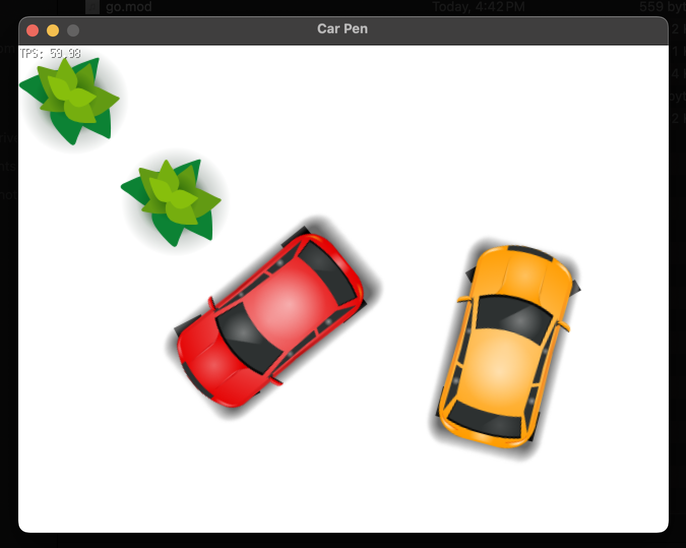

# CarPen
Mini Game: Park your car carefully!
CarPen wrote with GoLang using [Ebiten](https://github.com/hajimehoshi/ebiten)

  

## Instructions

1. Clone the project: `git clone https://github.com/cmajid/CarPen.git`
2. Change directory to `CarPen/`: `cd CarPen/`
3. Run `go run .` or run `go build` 

Once the window is open, one can do the following:

* `[Arrow-Keys]` - Move the car

Enjoy!
